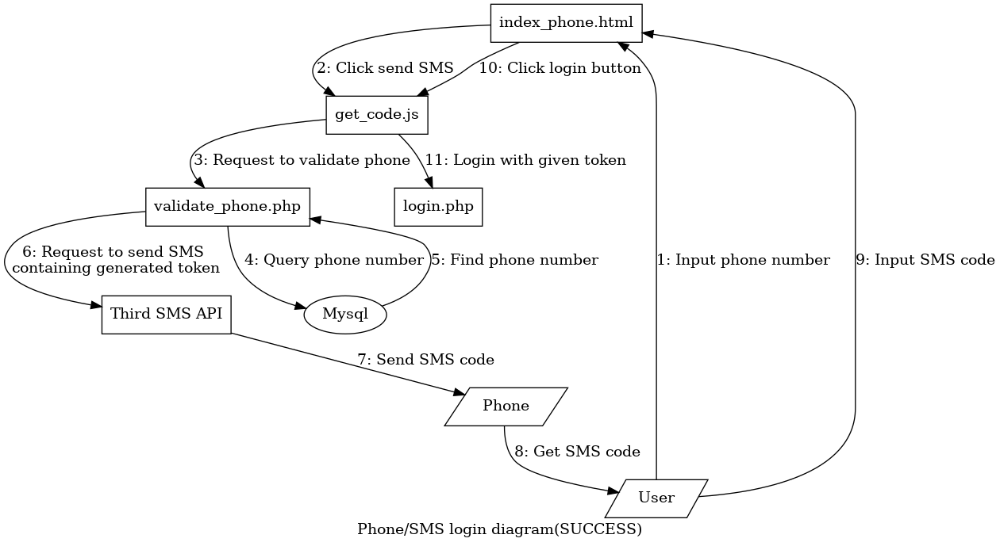

[toc]

# 《Web技术课程》实验报告（2020秋）

> 8208180119 信安1802 李胜淇

## 实验目的

通过设计并实现一个简单全栈系统的方式提升对 `Web` 相关技术的理解、掌握及应用。

## 实验任务

本次实验任务为实现一个登录页面。具体要求如下:

1.  实现前端页面的基本布局。要求:

    - [x] 布局类似于[学校门户](http://my.csu.edu.cn/login/index.jsp)

    - [x] 顶部需有 `LOGO` 栏目;

    - [x] 左侧提供轮播图;

    - [x] 提供账号密码登录方式;

    - [x] 提供手机号码 + 短信验证码登录方式;

    - [x] 登录成功后跳到显示“登录成功”四字的页面(简单设计)

    - [x] \*提供忘记密码和修改密码功能;

    - [x] \*提供用户的增删改查。

2.  完成前后端数据交互(用 `JSON` 格式)

3.  数据操作要求:

    - [x] 数据统一存储在后端数据库中;

    - [x] 账号密码登录方式需进行验证,验证通过方能登录;

    - [x] 手机验证码需调用第三方短信接口发送验证码并进行验证;

    - [x] 后端实现技术不限、数据库系统不限。

> \* 为可选项目(加分项目)

## 其他说明

- [x] 实验独立完成;

- [x] 需在 2020 年 12 月 30 日前实验室时间现场提交检查,也可在其他时间检查(需提前预约);

- [x] 每个同学需在 2020 年 12 月 31 日提交完整的实验报告(发送至[邮箱](vlab@163.com));

- [x] 不能使用任何框架。

## 实验内容

### 技术栈

* 前端：`HTML` + `CSS` + `JavaScript`

* 后端：`PHP`

* 数据库：`SQL`

### 实验环境

运行在`virtualbox`上的`Linux`虚拟机，网络模式为NAT子网，通过`Port forward`将`Guest`的80端口绑定到`Host`的8000端口上。

`Lamp` = `Linux` + `Apache2` + `mariadb` + `php`

* `Linux`: `Linux kali 5.9.0-kali5-amd64 x86_64 GNU/Linux`

* `Apache2`: `Server version: Apache/2.4.46 (Debian)`

* `mariadb`: `mariadb Ver 15.1 Distrib 10.5.8-MariaDB, for debian-linux-gnu (x86_64)`

* `PHP`: `PHP 7.4.11 (cli) (built: Oct  6 2020 10:34:39) ( NTS )`

#### 第三方短信验证码API 

[短信验证码接口](https://www.tianqiapi.com/index/doc?version=sms)

请求方式: `GET`

URL: `https://yiketianqi.com/api`


### 项目架构

```bash
Web-Expr
├── account_delete.php  # *实现帐号删除
├── change_account.php  # *实现帐号更改
├── images              # 存储图片
├── index.html          # 帐号登录前端
├── index_phone.html    # 手机号登录前端
├── login.php           # 通用登录界面，使用token登录
├── lookup.html         # *帐号查询前端
├── lookup.php          # *帐号查询后端
├── new_user.html       # *帐号增加前端
├── new_user.php        # *帐号增加后端
├── password_change.php # *实现密码更改
├── README.md           # readme file
├── Report.md           # This file itself
├── scripts
│   ├── eye.js          # 实现显示和不显示（显示为点）密码
│   ├── get_code.js     # 实现手机号登录
│   ├── login.js        # 实现帐号登录
│   ├── lookup.js       # *帐号查询
│   ├── send_code.js    # *帐号增加
│   └── slides.js       # 实现轮播图
├── styles
│   ├── base.css        # base.css
│   └── style.css       # 实现登录界面布局
├── sync.sh             # 将项目同步到/var/www/html
├── validate_phone.php  # 验证手机并发送token
├── validate.php        # 验证帐号密码并发送token
└── Web-Expr.pdf        # 实验指导书

3 directories, 38 files
```

#### 前端架构


* `index.html`：用于帐号密码的登录

* `index_phone.html`：用于手机号的登录

#### 登录的架构

* 帐号密码登录（成功）

    


* 帐号密码登录（失败）

    

* 手机号登录（成功）

    

* 手机号登录（失败）
    
    

#### 帐号管理架构


其中`account_delete.php, change_account.php password_change.php` 不通过登录验证，而是通过使用内嵌`<form>`在的`token`（`<input type="hidden" name="token" value="...">`）进行身份验证。

### 部分核心代码

## 实验收获
