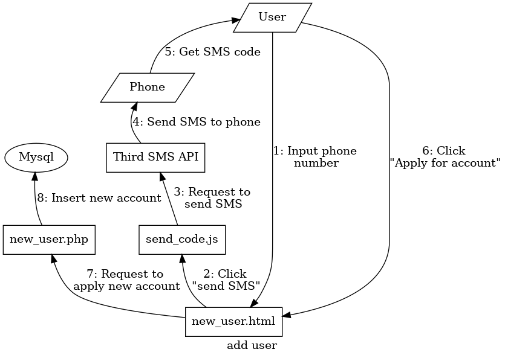

[toc]

# 《Web技术课程》实验报告（2020秋）

> 8208180119 信安1802 李胜淇

## 实验目的

通过设计并实现一个简单全栈系统的方式提升对 `Web` 相关技术的理解、掌握及应用。

## 实验任务

本次实验任务为实现一个登录页面。具体要求如下:

1. 实现前端页面的基本布局。要求:

    - 布局类似于[学校门户](http://my.csu.edu.cn/login/index.jsp)

    - 顶部需有 `LOGO` 栏目;

    - 左侧提供轮播图;

    - 提供账号密码登录方式;

    - 提供手机号码 + 短信验证码登录方式;

    - 登录成功后跳到显示“登录成功”四字的页面(简单设计)

    - 提供忘记密码和修改密码功能;

    - 提供用户的增删改查。

2. 完成前后端数据交互(用 `JSON` 格式)

3. 数据操作要求:

    - 数据统一存储在后端数据库中;

    - 账号密码登录方式需进行验证,验证通过方能登录;

    - 手机验证码需调用第三方短信接口发送验证码并进行验证;

    - 后端实现技术不限、数据库系统不限。

## 其他说明

- 实验独立完成;

- 需在 2020 年 12 月 30 日前实验室时间现场提交检查,也可在其他时间检查(需提前预约);

- 每个同学需在 2020 年 12 月 31 日提交完整的实验报告(发送至[邮箱](vlab@163.com));

- 不能使用任何框架。

## 实验内容

### 技术栈

- 前端：`HTML` + `CSS` + `JavaScript`

- 后端：`PHP`

- 数据库：`SQL`

### 实验环境

运行在`virtualbox`上的`Linux`虚拟机，网络模式为NAT子网，通过`Port forward`将`Guest`的80端口绑定到`Host`的8000端口上。

`Lamp` = `Linux` + `Apache2` + `mariadb` + `php`

- `Linux`: `Linux kali 5.9.0-kali5-amd64 x86_64 GNU/Linux`

- `Apache2`: `Server version: Apache/2.4.46 (Debian)`

- `mariadb`: `mariadb Ver 15.1 Distrib 10.5.8-MariaDB, for debian-linux-gnu (x86_64)`

- `PHP`: `PHP 7.4.11 (cli) (built: Oct  6 2020 10:34:39) ( NTS )`

#### 第三方短信验证码`API`

[短信验证码接口](https://www.tianqiapi.com/index/doc?version=sms)

**请求方式:** `GET`

**URL:** `https://yiketianqi.com/api`

**请求示例:**

```js
https://yiketianqi.com/api/sms?appid=&appsecret=&code=&moblie=
```

**请求参数说明:**

| 参数名    | 必须 | 类型   | 说明            |
|:----------|:-----|:------:|:----------------|
| appid     | Yes  | string | 用户appid       |
| appsecret | Yes  | string | 用户appsecret   |
| moblie    | Yes  | string | 手机号          |
| code      | Yes  | string | `4~6`位的验证码 |

**响应**`JSON`

```js
{"errcode": 0, "errmsg": "SUCCESS"}
```

**响应参数说明:**

| 参数名  | 类型    | 说明                             |
|:--------|:-------:|:---------------------------------|
| errcode | integer | 错误码（0表示正常，100表示失败） |
| errmsg  | string  | 错误提示                         |

### 项目架构

```bash
Web-Expr
├── account_delete.php  # *实现帐号删除
├── change_account.php  # *实现帐号更改
├── images              # 存储图片
├── index.html          # 帐号登录前端
├── index_phone.html    # 手机号登录前端
├── login.php           # 通用登录界面，使用token登录
├── lookup.html         # *帐号查询前端
├── lookup.php          # *帐号查询后端
├── new_user.html       # *帐号增加前端
├── new_user.php        # *帐号增加后端
├── password_change.php # *实现密码更改
├── README.md           # readme file
├── Report.md           # This file itself
├── scripts
│   ├── eye.js          # 实现显示和不显示（显示为点）密码
│   ├── get_code.js     # 实现手机号登录
│   ├── login.js        # 实现帐号登录
│   ├── lookup.js       # *帐号查询
│   ├── send_code.js    # *帐号增加
│   ├── slides.js       # 实现轮播图
│   └── switch.js       # 登录界面实现切换form
├── styles
│   ├── base.css        # base.css
│   ├── style_login.css # 实现用户界面布局
│   └── style.css       # 实现登录界面布局
├── sync.sh             # 将项目同步到/var/www/html
├── validate_phone.php  # 验证手机并发送token
├── validate.php        # 验证帐号密码并发送token
└── Web-Expr.pdf        # 实验指导书

3 directories, 38 files
```

#### 前端架构


- `index.html`：用于帐号密码的登录

    

- `index_phone.html`：用于手机号的登录

    

#### 登录的架构

登录的核心在于`token`，前后端的交互只是验证用户的身份，在帐号密码登录中，后端在验证身份有效后，动态的分配用户一个`token`，前端使用分配的`token`进行真正的登录。而在手机号登录中，`token`就是短信验证码。

因为后端只验证不登录，所以可以通过`Ajax`返回不同的错误信息，比如用户名不存在和密码错误。手机登录则能提示已经发送短信。

##### 登陆的流程图

- 帐号密码登录（成功）

    

- 帐号密码登录（失败）

    

- 手机号登录（成功）

    

- 手机号登录（失败）

    

#### 帐号管理架构


其中`account_delete.php`，`change_account.php` 和 `password_change.php` 不通过登录验证，而是通过使用内嵌`<form>`在的`token`和`username`在提交表格的时候自动提交来让后端进行身份验证。（如下图所示）

```html
<input type="hidden" name="token" value="...">
<input type="hidden" name="username" value="...">
```

##### 用户信息查询架构


除了动态的对用户的输入进行查询以外，登录界面会动态的在帐号信息查询展示用户自身的信息。


#### 申请新帐号的架构



这里采用了和手机号登陆不同的处理方式，在手机号登陆中，后端调用了短信`API`，而在通过手机号申请新用户的过程中，前端调用的短信`API`。

## 实验收获
