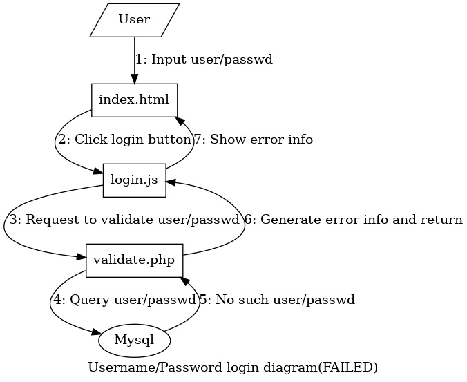
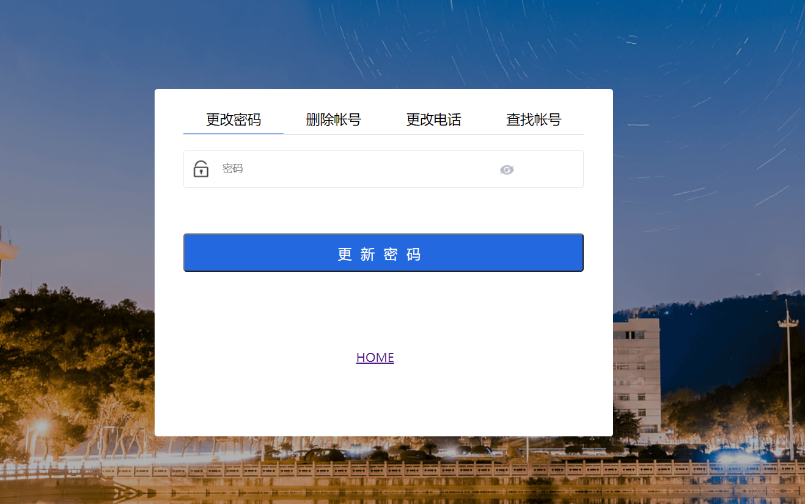
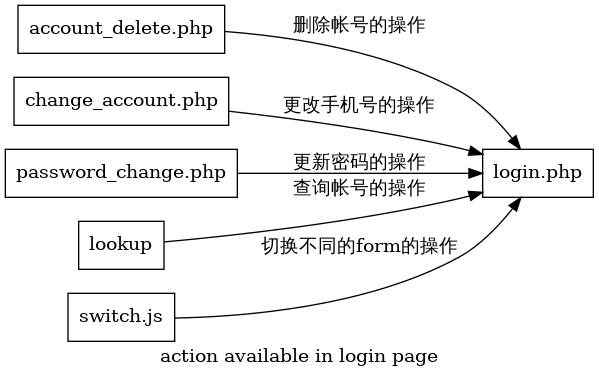

[toc]

# 《Web技术课程》实验报告（2020秋）

> 8208180119 信安1802 李胜淇

## 实验目的

通过设计并实现一个简单全栈系统的方式提升对 `Web` 相关技术的理解、掌握及应用。

## 实验任务

本次实验任务为实现一个登录页面。具体要求如下:

1. 实现前端页面的基本布局。要求:

    - 布局类似于[学校门户](http://my.csu.edu.cn/login/index.jsp)

    - 顶部需有 `LOGO` 栏目;

    - 左侧提供轮播图;

    - 提供账号密码登录方式;

    - 提供手机号码 + 短信验证码登录方式;

    - 登录成功后跳到显示“登录成功”四字的页面(简单设计)

    - 提供忘记密码和修改密码功能;

    - 提供用户的增删改查。

2. 完成前后端数据交互(用 `JSON` 格式)

3. 数据操作要求:

    - 数据统一存储在后端数据库中;

    - 账号密码登录方式需进行验证,验证通过方能登录;

    - 手机验证码需调用第三方短信接口发送验证码并进行验证;

    - 后端实现技术不限、数据库系统不限。

## 其他说明

- 实验独立完成;

- 需在 2020 年 12 月 30 日前实验室时间现场提交检查,也可在其他时间检查(需提前预约);

- 每个同学需在 2020 年 12 月 31 日提交完整的实验报告(发送至[邮箱](vlab@163.com));

- 不能使用任何框架。

## 实验内容

### 技术栈

- 前端：`HTML` + `CSS` + `JavaScript`

- 后端：`PHP`

- 数据库：`SQL`

### 实验环境

运行在`virtualbox`上的`Linux`虚拟机，网络模式为NAT子网，通过`Port forward`将`Guest`的80端口绑定到`Host`的8000端口上。

`Lamp` = `Linux` + `Apache2` + `mariadb` + `php`

- `Linux`: `Linux kali 5.9.0-kali5-amd64 x86_64 GNU/Linux`

- `Apache2`: `Server version: Apache/2.4.46 (Debian)`

- `mariadb`: `mariadb Ver 15.1 Distrib 10.5.8-MariaDB, for debian-linux-gnu (x86_64)`

- `PHP`: `PHP 7.4.11 (cli) (built: Oct  6 2020 10:34:39) ( NTS )`

#### 第三方短信验证码`API`

[短信验证码接口](https://www.tianqiapi.com/index/doc?version=sms)

**请求方式:** `GET`

**URL:** `https://yiketianqi.com/api`

**请求示例:**

```js
https://yiketianqi.com/api/sms?appid=&appsecret=&code=&moblie=
```

**请求参数说明:**

| 参数名    | 必须 | 类型   | 说明            |
|:----------|:-----|:------:|:----------------|
| appid     | Yes  | string | 用户appid       |
| appsecret | Yes  | string | 用户appsecret   |
| moblie    | Yes  | string | 手机号          |
| code      | Yes  | string | `4~6`位的验证码 |

**响应**`JSON`

```js
{"errcode": 0, "errmsg": "SUCCESS"}
```

**响应参数说明:**

| 参数名  | 类型    | 说明                             |
|:--------|:-------:|:---------------------------------|
| errcode | integer | 错误码（0表示正常，100表示失败） |
| errmsg  | string  | 错误提示                         |

### 项目架构

```bash
Web-Expr
├── account_delete.php  # *实现帐号删除
├── change_account.php  # *实现帐号更改
├── images              # 存储图片
├── index.html          # 帐号登录前端
├── index_phone.html    # 手机号登录前端
├── login.php           # 通用登录界面，使用token登录
├── lookup.html         # *帐号查询前端
├── lookup.php          # *帐号查询后端
├── new_user.html       # *帐号增加前端
├── new_user.php        # *帐号增加后端
├── password_change.php # *实现密码更改
├── README.md           # readme file
├── Report.md           # This file itself
├── scripts
│   ├── eye.js          # 实现显示和不显示（显示为点）密码
│   ├── get_code.js     # 实现手机号登录
│   ├── login.js        # 实现帐号登录
│   ├── lookup.js       # *帐号查询
│   ├── send_code.js    # *帐号增加
│   ├── slides.js       # 实现轮播图
│   └── switch.js       # 登录界面实现切换form
├── styles
│   ├── base.css        # base.css
│   ├── style_login.css # 实现用户界面布局
│   └── style.css       # 实现登录界面布局
├── sync.sh             # 将项目同步到/var/www/html
├── validate_phone.php  # 验证手机并发送token
├── validate.php        # 验证帐号密码并发送token
└── Web-Expr.pdf        # 实验指导书

3 directories, 38 files
```

#### 前端架构


- `index.html`：用于帐号密码的登录

    

- `index_phone.html`：用于手机号的登录

    

#### 登录的架构

登录的核心在于`token`，前后端的交互（通过`Ajax`+`JSON`）只是验证用户的身份，在帐号密码登录中，后端在验证身份有效后，动态的分配用户一个`token`，前端使用分配的`token`进行真正的登录。而在手机号登录中，`token`就是短信验证码。

因为后端只验证不登录，所以可以通过`Ajax`返回不同的错误信息，比如用户名不存在和密码错误。手机登录则能提示已经发送短信和验证码已过时。


##### 登陆的流程图

- 帐号密码登录（成功）

    

- 帐号密码登录（失败）

    

- 手机号登录（成功）

    

- 手机号登录（失败）

    

#### 用户中心帐号管理架构



用户通过切换不同的表单，提交不同的操作



其中`account_delete.php`，`change_account.php` 和 `password_change.php` 不通过登录验证，而是通过使用内嵌`<form>`在的`token`和`username`在提交表格的时候自动提交来让后端进行身份验证。（如下图所示）

```html
<input type="hidden" name="token" value="...">
<input type="hidden" name="username" value="...">
```

而在通过`account_delete.php`，`change_account.php` 和 `password_change.php`进行完对应操作后（如果没有出错），后端会重定向回`login.php`

*重定向代码*

```php
/* 如果操作执行成功 */
if ($stmt->affected_rows > 0) {
    /* 重定向回用户中心 */
    header("Location: ./login.php?username=" . $_GET['username'] . "&token=" . $_GET['token']);
    exit();
}
```

##### 用户信息查询架构


除了动态的对用户的输入进行查询以外，登录界面会动态的在帐号信息查询展示用户自身的信息。


#### 申请新帐号的架构


这里采用了和手机号登陆不同的处理方式，在手机号登陆中，后端调用了短信`API`，而在通过手机号申请新用户的过程中，前端调用的短信`API`。（这么做的主要原因是因为免费的短信调用接口不足了-_-||）

### 部分核心代码

#### 前端特效代码

##### 密码显示与不显示

通过`eye.js`实现

```js
var eye = document.getElementById('eye');
// 如果眼睛图标被点击
eye.onclick = function() {
    // 获取密码输入框
    var item = document.querySelector('div#password > input');
    // 如果密码不可见
    if (eye.classList.contains('eye_close')) {
        // 将密码设为可见
        eye.className = "input_eye eye_open";
        item.setAttribute('type', 'text');
    }
    else {
        // 将密码设为不可见
        eye.className = "input_eye eye_close";
        item.setAttribute('type', 'password');
    }
}
```

##### 轮播图

相关`html`代码

```html
<!-- slides container -->
<div class="slides">
    
    
    
</div>

<!-- 其他代码 --> 

<!-- dots to control slides -->
<div class="dots">
    <span class="dot active"></span>
    <span class="dot"></span>
    <span class="dot"></span>
</div>
```

对应`css`代码

```css
div.slides {
    height: 100%;
}

div.slides img {
    opacity: 0;
    /* 动画效果 */
    transition: opacity .2s;
    display: none;
}

div.slides img.active {
    opacity: 1;
    display: block;
}

/* 其他代码 */


div.dots {
    text-align: center;
    position: absolute;
    bottom: 2%;
    left:35%;
    right:35%;
}

span.dot {
    cursor: pointer;
    display: inline-block;
    height: 15px;
    width: 15px;
    border-radius: 50%;
    margin: 0 2px;
    background-color: #bbb;
    /* 动画效果 */
    transition: background-color 0.6 ease;
}

span.dot.active, span.dot:hover {
    background-color: #717171;
}
```

通过`slides.js`实现

```js
function slides_show() {
    var images = document.querySelectorAll(".slides img");
    var dots   = document.querySelectorAll(".dots span");

    var index  = 0;

    // 每隔一段时间切换下一张背景
    setInterval(() => {
        index = (index + 1) % images.length;

        // 清除所有的属性
        images.forEach((v, k) => {
            v.className       = "";
            dots[k].className = "dot";
        })

        // 将自己设置为激活
        images[index].className = "active";
        dots[index].className   = "dot active";
    }, 2000);

    // 对于每一个dot
    dots.forEach((v, k) => {
        // 当他被点击时
        v.onclick = () => {
            // 清除所有的属性
            images.forEach((value, key) => {
                value.className       = "";
                dots[key].className = "dot";
            })

            // 将自己设置为激活
            v.className = "dot active";
            index = k; // 记得修改index
            images[k].className = "active";
        }
    })
}

slides_show();
```

##### 用户中中心切换`form`

相关`html`代码

```html
<div class="methods_tab">
    <span class="active">更改密码</span>
    <span class="">删除帐号</span>
    <span class="">更改电话</span>
    <span class="">查找帐号</span>
</div>
<div class="form_wrap active">
    <!-- 对应表单 -->
</div>
<div class="form_wrap">
    <!-- 对应表单 -->
</div>
<div class="form_wrap">
    <!-- 对应表单 -->
</div>
<div class="form_wrap">
    <!-- 对应表单 -->
</div>
```

相关`css`代码

```css
div.methods_tab {
    width: 100%;
    border-bottom: 1px solid #DEDEDE;
    z-index: 10;
    overflow: hidden;
    font-size: 12px;
}

div.methods_tab span {
    width: 25%;
    display: block;
    float: left;
    position: relative;
    z-index: 2;
    cursor: pointer;
    font-size: 18px;
    text-align: center;
    line-height: 20px;
    padding: 8px 0;
}

div.methods_tab span.active {
    border-bottom: 1px solid #2B6CDB;
}

div.form_wrap {
    display: none;
    opacity: 0;
}

div.form_wrap.active {
    display: block;
    opacity: 1;
}
```

由`switch.js`实现

```js
var spans = document.querySelectorAll("div.methods_tab span");
var forms = document.querySelectorAll("div.form_wrap");
spans.forEach((v, k) => {
    v.onclick = function() {
        spans.forEach((v) => {
            v.className = "";
        });
        forms.forEach((v) => {
            v.className = "form_wrap";
        });
        v.className = "active";
        forms[k].className = "form_wrap active";
    }
});
```

#### `Ajax`代码

这里给出代码的架构，而不是实际的代码（因为`Ajax`整个项目到处都在用）

##### `Ajax`前端

```js
document.querySelector("要绑定的Tag").要绑定的操作 = function() {
    // 将要发送的数据包装为JSON
    var data = {
        // ...
    };

    var xmlhttp = new XMLHttpRequest();
    // 回调函数
    xmlhttp.onreadystatechange = function() {
        if (this.readyState == 4 && this.status == 200) {
            // 将数据使用JSON解析
            var json = JSON.parse(this.responseText);
            // 根据访问的数据进行不同的操作
        }
    };

    // 将数据以JSON的格式发送
    xmlhttp.open("POST", "对应的后端", true);
    xmlhttp.setRequestHeader("Content-type", "application/json"); // 设置请求头
    xmlhttp.send(JSON.stringify(login));
}
```

##### `Ajax`后端

```php
<?php
/* 连接数据库 */
$db_hostname = 'localhost';
$db_database = 'webserver';
$db_username = 'php';
$db_password = 'php';
$db_server   = new mysqli($db_hostname, $db_username, $db_password, $db_database);
if ($db_server->connect_error) die ("Connection Failed: " . $db_server->connect_error());

/* 将数据通过JSON解析 */
$json     = json_decode(file_get_contents('php://input'));

/* 准备对应的查询语句 */ 
$stmt = $db_server->prepare("对应的查询语句");

if ($stmt) {
    /* 执行查询 */
    $stmt->bind_param(...); // 绑定参数
    $stmt->execute(); // 执行
    $stmt->bind_result(...); // 绑定结果
    $stmt->fetch(); // 获取结果

    // 根据查询结果，构造不同的数据

    /* 以JSON的格式返回数据 */
    echo json_encode($response);
    $stmt->close();
}

$db_server->close();
?>
```

#### `token`

##### 分配`token`

`PHP`中，`$_SESSION`是全局的关联数组，在整个`TCP`会话中存活，在任何`PHP`文件中都可以访问。

```php
// 为了安全，可以给token加上
// 对应session id：确认是同一个浏览器的同一个会话
// timestamp: 防止重放
$response->token  = rand();
// keep login status
$_SESSION[$username] = $response->token;
```

##### 验证`token`

`PHP`中，`$_GET`是全局的关联数组，对应每个`PHP`被访问时的`GET`参数，相似的还有`$_POST`。

```php
// 如果存在$_GET['username']
if (isset($_GET['username'])) {
    // 验证token是否一致
    if ($_GET['token'] == $_SESSION[$_GET['username']]) {
        // ...
    }
}
```

#### 重定向

在项目中，无论前端还是后端都执行了一些重定向

##### 前端重定向

获得`token`后，重定向到登陆界面

```js
document.getElementById('show_error').style.opacity = 0;
// jamp to login page with given token
document.location.assign(document.location.origin + '/Web-Expr/login.php?' + "username=" + login.username + "&token=" + json.token);
```

##### 后端重定向

再执行操作后，返回用户中心

```php
header("Location: ./login.php?username=" . $username . "&token=" . $token);
exit();
```

## 实验收获

1. 学会了结合`html+css+javascript`，来实现各种效果（轮播图，切换表单等）

2. 熟悉使用`absolute`和`flex-box`两种布局方式

3. 熟悉使用`CSS Selector`来更好的与`DOM`交互

4. 学会了使用`PHP`与数据库进行交互

5. 熟悉使用`PHP+JavaScript`实现`Ajax`

6. 学会了`Ajax`和传统`form`提交来和后端交互

7. 学会了使使用前端和后端重定向操作

8. 学会了调用第三方API

9. 熟悉使用`git`和`github`来进行版本控制
